


  
  &nbsp;
  
  &nbsp;
  

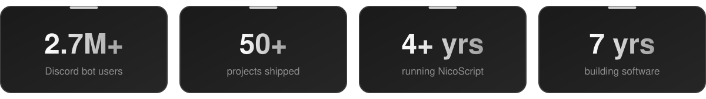

 

## <picture><source media="(prefers-color-scheme: dark)" srcset="assets/icons/white/user.svg"></picture>&nbsp; About

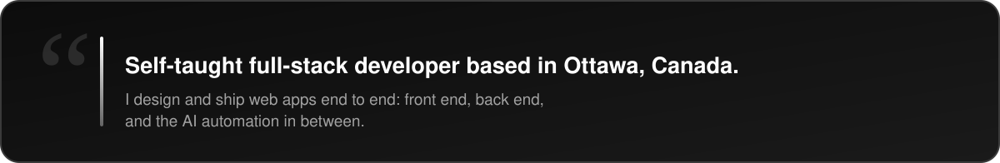

I started out building a Discord bot that grew to 2.7M+ users, which pulled me deeper into web development. I sharpened that at the intensive [Lighthouse Labs](https://www.lighthouselabs.ca/) bootcamp, and today I run [NicoScript](https://www.nicoscript.com/), designing and building custom web apps, UI/UX, and performance-tuned sites for clients.

  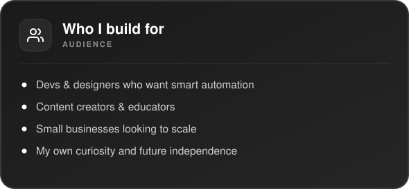
  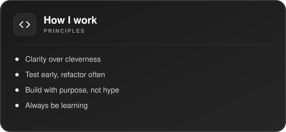

## <picture><source media="(prefers-color-scheme: dark)" srcset="assets/icons/white/folder.svg"></picture>&nbsp; Projects

  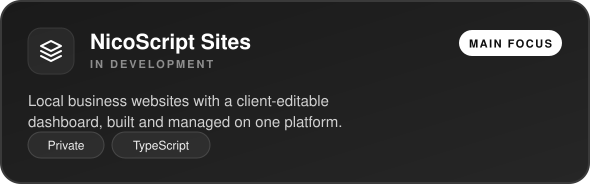
  <a href="https://www.toolfurnace.com/">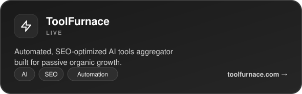</a>

  <a href="https://github.com/Monsieur-Nico/textConvert">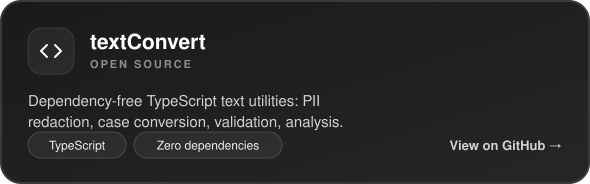</a>
  <a href="https://github.com/Monsieur-Nico/Self-Education-in-Computer-Science">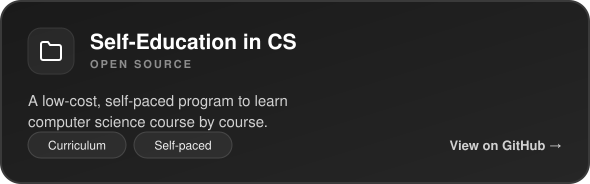</a>

More on my <a href="https://www.nicoscript.com/#projects">portfolio</a> →

## <picture><source media="(prefers-color-scheme: dark)" srcset="assets/icons/white/layers.svg"></picture>&nbsp; Tech Stack

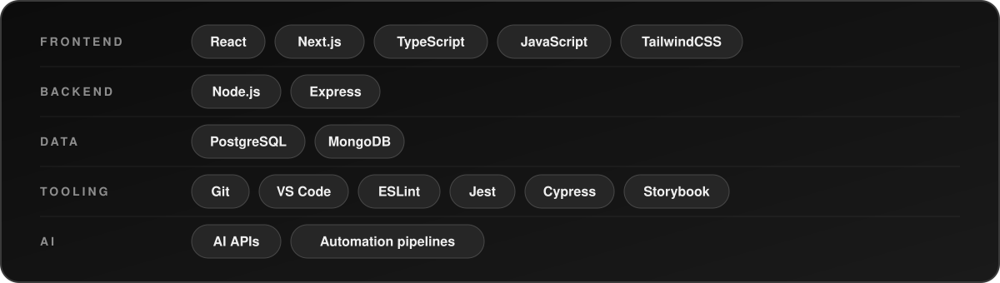

## <picture><source media="(prefers-color-scheme: dark)" srcset="assets/icons/white/briefcase.svg"></picture>&nbsp; Experience

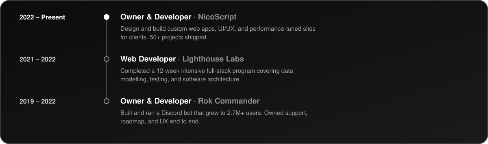

## <picture><source media="(prefers-color-scheme: dark)" srcset="assets/icons/white/target.svg"></picture>&nbsp; 2026 Goals

- [ ] Launch NicoScript Sites and onboard the first clients
- [ ] Grow ToolFurnace into a self-sustaining traffic engine
- [ ] Go deeper on API security and AI-driven automation pipelines
- [ ] Grow NicoScript's client base and my personal brand

## <picture><source media="(prefers-color-scheme: dark)" srcset="assets/icons/white/bar-chart.svg"></picture>&nbsp; GitHub Stats

  
  &nbsp;
  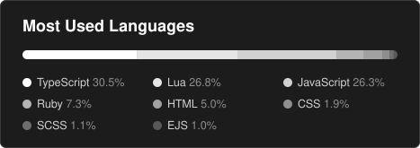

  

---

<i>“Build boldly. Learn loudly. Launch often.”</i>

Thanks for stopping by.

